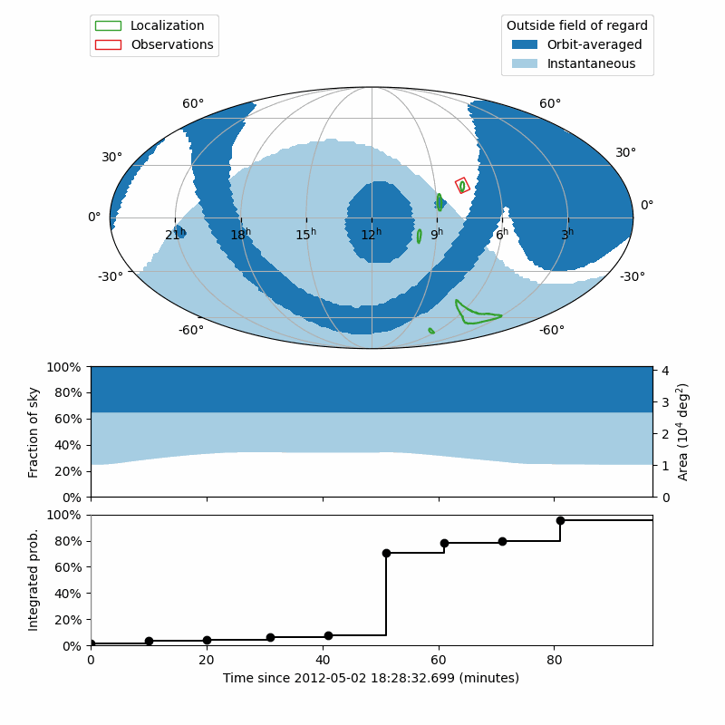

# Dorado observation planning and scheduling simulations

Dorado is a proposed space mission for ultraviolet follow-up of gravitational
wave events. This repository contains a simple target of opportunity
observation planner for Dorado.



## Features

*   **Global**: jointly and globally solves the problems of tiling (the set of
    telescope boresight orientations and roll angles) and the scheduling (which
    tile is observed at what time), rather than solving each sub-problem one at
    a time
*   **Optimal**: generally solves all the way to optimality, rather than
    finding merely a "good enough" solution
*   **Fast**: solve an entire orbit in about 5 minutes
*   **General**: does not depend on heuristics of any kind
*   **Flexible**: problem is formulated in the versatile framework of
    [mixed integer programming]

## Dependencies

*   [Astropy]
*   [Astroplan] for calculating the field of regard
*   [HEALPix], [Healpy], and [astropy-healpix] for observation footprints
*   [sgp4] for orbit propagation
*   [CPLEX] (via [docplex] Python interface) for constrained optimization

## Problem formulation

Given a gravitational-wave HEALPix probability sky map, this Python package
finds an optimal sequence of Dorado observations to maximize the probability of
observing the (unknown) location of the gravitational-wave event, within one
orbit.

The problem is formulated as a mixed integer programming problem with the
following arrays of binary decision variables:

*   `schedule` (`npix` × `nrolls` × `ntimes - ntimes_per_exposure + 1`): 1 if
    an observation of the field that is centered on the given HEALPix pixel, at
    a given roll angle, is begun on a given time step; or 0 otherwise
*   `pix` (`npix`): 1 if the given HEALPix pixel is observed, or 0
    otherwise

The problem has the following parameters:

*   `nexp` (scalar, integer): the maximum number of exposures
*   `prob` (`npix`, float): the probability sky map
*   `regard` (`npix` × `ntimes`, binary): 1 if the field centered on
    the given HEALPix pixel is within the field of regard at the given time, 0
    otherwise

The objective function is the sum over all of the pixels in the probability sky
map for which the corresponding entry in `pix` is 1.

The constraints are:
*   At most one observation is allowed at a time.
*   At most `nexp` observations are allowed in total.
*   A given pixel is observed if any field that contains it within its
    footprint is observed.
*   A field may be observed only if it is within the field of regard.

## Usage

### To install

To install with [Pip]:

1.  Run the following command:

        $ pip install git+https://github.com/dorado-science/dorado-scheduling

### To set up the CPLEX optimization engine

2.  Set up the CPLEX optimization engine by following the
    [docplex instructions]. If you have [installed CPLEX locally], then all you
    have to do is determine the path to the CPLEX Python bindings and add them
    to your `PYTHONPATH`. For example, on macOS, this might be:

        $ export PYTHONPATH=/Applications/CPLEX_Studio1210/cplex/python/3.7/x86-64_osx

For those using CPLEX_Studio1210 through IBM's Academic Initiative program,
instead of an API key, instead the download contains everything that is
needed. For HPC resources, simply download the Linux bin and the standard
installer (e.g. bin ILOG_COS_20.10_LINUX_X86_64.bin) allows you to install
to your local home directory (and then the instructions above are the same).

### To generate an observing plan

3.  Generate an observing plan for the included example sky map:

        $ dorado-scheduling examples/6.fits -o examples/6.ecsv

    This will take 3 minutes and will use about 10 GB of memory at peak.

4.  Print out the observing plan:

        $ cat examples/6.ecsv 
        # %ECSV 0.9
        # ---
        # datatype:
        # - {name: time, datatype: string}
        # - {name: center.ra, unit: deg, datatype: float64}
        # - {name: center.dec, unit: deg, datatype: float64}
        # - {name: roll, unit: deg, datatype: float64}
        # meta:
        #   __serialized_columns__:
        #     center:
        #       __class__: astropy.coordinates.sky_coordinate.SkyCoord
        #       dec: !astropy.table.SerializedColumn
        #         __class__: astropy.coordinates.angles.Latitude
        #         unit: &id001 !astropy.units.Unit {unit: deg}
        #         value: !astropy.table.SerializedColumn {name: center.dec}
        #       frame: icrs
        #       ra: !astropy.table.SerializedColumn
        #         __class__: astropy.coordinates.angles.Longitude
        #         unit: *id001
        #         value: !astropy.table.SerializedColumn {name: center.ra}
        #         wrap_angle: !astropy.coordinates.Angle
        #           unit: *id001
        #           value: 360.0
        #       representation_type: spherical
        #     time:
        #       __class__: astropy.time.core.Time
        #       format: isot
        #       in_subfmt: '*'
        #       out_subfmt: '*'
        #       precision: 3
        #       scale: utc
        #       value: !astropy.table.SerializedColumn {name: time}
        #   cmdline: dorado-scheduling examples/6.fits
        #     -o examples/6.ecsv
        #   prob: 0.9328184882724184
        #   real: 90.992567837
        #   status: OPTIMAL_SOLUTION
        #   sys: 12.163171
        #   user: 78.007511
        # schema: astropy-2.0
        time center.ra center.dec roll
        2012-05-02T18:28:32.699 65.25 -60.434438844952275 0.0
        2012-05-02T18:40:32.699 51.74999999999999 -60.434438844952275 0.0
        2012-05-02T18:51:32.699 79.28571428571429 -58.91977535280316 80.0
        2012-05-02T19:01:32.699 91.95652173913044 -55.87335043525197 60.0
        2012-05-02T19:11:32.699 106.07142857142857 -69.42254649458224 20.0
        2012-05-02T19:22:32.699 146.25 -13.24801490567695 20.0
        2012-05-02T19:33:32.699 146.25 -5.979156796301311 20.0
        2012-05-02T19:44:32.699 115.31249999999999 18.20995686428301 20.0
        2012-05-02T19:56:32.699 133.59375 7.180755781458282 20.0

5.  To generate an animated visualization for this observing plan, run the
    following command:

        $ dorado-scheduling-animate examples/6.fits examples/6.ecsv examples/6.gif

    This will take about 2-5 minutes to run.

### Determining if a given sky position is contained within an observing plan

The following example illustrates how to use HEALPix to determine if a given
sky position is contained in any of the fields in an observing plan:

```pycon
>>> from astropy.coordinates import ICRS, SkyCoord
>>> from astropy.table import QTable
>>> from astropy_healpix import HEALPix
>>> from astropy import units as u
>>> from dorado.scheduling import FOV
>>> healpix = HEALPix(nside=32, frame=ICRS())
>>> target = SkyCoord(66.91436579*u.deg, -61.98378895*u.deg)
>>> target_pixel = healpix.skycoord_to_healpix(target)
>>> schedule = QTable.read('examples/6.ecsv')
>>> fov = FOV.from_rectangle(7.1 * u.deg)
>>> footprints = [fov.footprint_healpix(healpix, row['center'], row['roll'])
...               for row in schedule]
>>> schedule['found'] = [target_pixel in footprint for footprint in footprints]
>>> schedule
<QTable length=8>
            time          exptime ...   roll  found
                            min   ...   deg        
            object         float64 ... float64  bool
----------------------- ------- ... ------- -----
2012-05-02T18:28:32.699    10.0 ...    60.0 False
2012-05-02T18:38:32.699    10.0 ...    40.0 False
2012-05-02T18:48:32.699    10.0 ...    80.0 False
2012-05-02T18:58:32.699    10.0 ...    50.0  True
2012-05-02T19:23:32.699    10.0 ...    80.0 False
2012-05-02T19:33:32.699    10.0 ...    20.0 False
2012-05-02T19:43:32.699    10.0 ...    20.0 False
2012-05-02T19:57:32.699    10.0 ...     0.0 False
```

[Pip]: https://pip.pypa.io
[mixed integer programming]: https://en.wikipedia.org/wiki/Integer_programming
[Astropy]: https://www.astropy.org
[Astroplan]: https://github.com/astropy/astroplan
[HEALPix]: https://healpix.jpl.nasa.gov
[astropy-healpix]: https://github.com/astropy/astropy-healpix
[Healpy]: https://github.com/healpy/healpy
[sgp4]: https://pypi.org/project/sgp4/
[install Poetry]: https://python-poetry.org/docs/#installation
[CPLEX]: https://www.ibm.com/products/ilog-cplex-optimization-studio
[docplex]: https://ibmdecisionoptimization.github.io/docplex-doc/
[docplex instructions]: https://ibmdecisionoptimization.github.io/docplex-doc/mp/getting_started.html
[installed CPLEX locally]: https://ibmdecisionoptimization.github.io/docplex-doc/mp/getting_started.html#using-ibm-ilog-cplex-optimization-studio-on-your-computer
